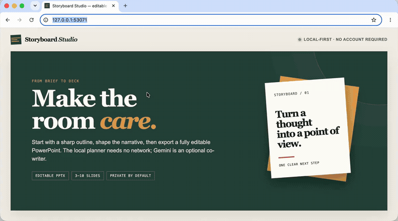

# Storyboard Studio

> Turn a private decision brief into a story you can defend, a native
> PowerPoint you can edit, and a Narrative Receipt you can verify.

For product and operations leads whose decisions get buried in generic slide
piles: Storyboard Studio exposes the argument, flags unsupported claims, and
keeps the entire no-key workflow local.

[](docs/assets/storyboard-demo-app-only.mp4)

**Proof:** [watch the app-only MP4](docs/assets/storyboard-demo-app-only.mp4) · [read the accessible transcript](docs/demo.md) · [download three receipt-verified decks](gallery/README.md) · [reproduce the 10-brief benchmark](docs/BENCHMARK.md)

After installation, create the complete local proof bundle with one command:

```bash
storyboard demo --bundle --output storyboard-demo.pptx
```

[**Explore the live showcase →**](https://othmaneblial.github.io/Storyboard-Studio/) · [Quick start](#quick-start) · [Why not Presenton or Slidev?](docs/COMPARISON.md) · [Security](SECURITY.md)

[](https://github.com/OthmaneBlial/Storyboard-Studio/actions/workflows/ci.yml) [](https://github.com/OthmaneBlial/Storyboard-Studio/releases/latest) [](LICENSE) [](#privacy-and-data)

Current release: **v0.2.0**. The guided decision story, Narrative Doctor, and
Receipt workflow are available on `main` for the next release; see the
[changelog](CHANGELOG.md) for the exact unreleased boundary.

## Why Storyboard Studio?

Most presentation generators make a pile of slides. Storyboard Studio starts
with the decision story: its local compiler creates a visible argument from the
author's own fields, the Doctor explains what is weak, and the renderer produces
an editable 16:9 `.pptx` without pretending that a URL or model output is true.

The first workflow is a **private decision brief** for consultants, product and
operations leads, and enablement teams: one decision, the trade-off, and a
reviewable next step. Start from the structured
[`examples/briefs/onboarding-decision.json`](examples/briefs/onboarding-decision.json)
if you want a concrete path; the [template catalog](docs/TEMPLATES.md) keeps
unvalidated expansion dormant.

- **Useful without an API key.** The guided compiler uses the decision fields
  you supplied instead of topic-agnostic filler or fabricated facts.
- **Inspectable before export.** The story map and Narrative Doctor expose weak
  progression, duplication, evidence gaps, density, ownership, and next steps.
- **One preview/export contract.** A zoomable 16:9 canvas and PowerPoint share
  validated geometry, contrast-aware themes, font fallbacks, and overflow rules.
- **Portable review proof.** Export a `.pptx`, `.story.json`, and
  `.receipt.json`; verify hashes locally without claiming factual verification.
- **Claim-level evidence trail.** Link complete local/public source metadata to
  slide claims, keep unresolved gaps visible, and generate an approved citations appendix.
- **Explicit provider boundary.** Keep the deterministic local default, or explicitly select configured Gemini or an experimental loopback-only OpenAI-compatible endpoint; every run shows model, network state, policy, and fallback.
- **Editable by design.** The export uses PowerPoint text and shapes — no flattened slide screenshots.
- **Private by default.** No account, database, analytics, or shared server-side presentation state.
- **A real first success.** Open the app, write a brief, review the story, and download a deck in minutes.

## Quick start

Requires Python 3.10 or newer.

```bash
git clone https://github.com/OthmaneBlial/Storyboard-Studio.git
cd Storyboard-Studio
make setup
make run
```

Open [http://127.0.0.1:8000](http://127.0.0.1:8000). Storyboard works locally without configuration or a network provider.

### Optional provider setup

Copy the example file, add your own API key locally, then restart the server:

```bash
cp .env.example .env
# Export GEMINI_API_KEY in your shell or secret manager; .env is intentionally not auto-loaded.
export GEMINI_API_KEY="your-key"
make run
```

`GEMINI_MODEL` defaults to the release-configured `gemini-2.5-flash`; override
it when your provider account needs another structured-output-capable model.
Check Google’s model reference for current availability and read the
[`provider policy`](docs/PROVIDER_POLICY.md) before sending authorized material.

For a local Ollama/LM Studio-style endpoint, set
`OPENAI_COMPATIBLE_BASE_URL` to a loopback `/v1` URL and set
`OPENAI_COMPATIBLE_MODEL`. Remote OpenAI-compatible hosts are rejected. The
browser still defaults to the offline planner and requires a provider choice
for each draft. Provider requests never include local files, assets, evidence,
sources, or notes; see the complete supported-state and retention matrix in
[`docs/PROVIDER_POLICY.md`](docs/PROVIDER_POLICY.md).

## How it works

1. **Brief the deck** — add a topic, audience/outcome, slide count, tone, and optional slide-level focuses.
2. **Inspect the narrative** — review the title slide plus the editable three-point sequence before exporting.
3. **Own the final file** — export a native PowerPoint deck and refine it in your usual presentation tool.

The FastAPI service validates every public request, limits request size and local rate, creates each export with a random isolated ID, and removes generated server copies after 24 hours.

## Command-line export

Render any valid Storyboard payload without opening the browser:

```bash
make export-sample
# creates output/product-brief.pptx from examples/product-brief.json

make smoke
# starts a disposable local server and verifies brief → API → editable PPTX
```

Or choose your own files:

```bash
storyboard export --input examples/product-brief.json --output output/my-deck.pptx
```

The installed package also includes an offline synthetic demo and deterministic
narrative diagnostics:

```bash
storyboard demo --output output/storyboard-demo.pptx
storyboard doctor examples/product-brief.json --format markdown
storyboard templates --all
storyboard preflight examples/product-brief.json --fail-on-overflow
storyboard brand-kit themes/brand-kit.example.json
storyboard evidence examples/fixtures/evidence-edge-cases.json
```

Compile a structured decision brief, export its review bundle, then verify the
local artifacts:

```bash
storyboard compile \
  --input examples/briefs/onboarding-decision.json \
  --output output/onboarding.story.json
storyboard doctor output/onboarding.story.json --format markdown
storyboard export \
  --input output/onboarding.story.json \
  --output output/onboarding.pptx \
  --bundle
storyboard verify output/onboarding.receipt.json
```

Legacy presentation JSON is never silently reinterpreted as a decision brief:

```bash
storyboard migrate examples/product-brief.json --output output/legacy.story.json
storyboard diff output/legacy.story.json output/onboarding.story.json
```

Reviewed stories also round-trip through strict Markdown for Git review. The
same Markdown renders directly; sources, notes, typed blocks, assets, and story
metadata remain intact:

```bash
storyboard export --input output/onboarding.story.json --output output/onboarding.story.md
storyboard import output/onboarding.story.md --output output/restored.story.json
storyboard export --input output/onboarding.story.md --output output/restored.pptx
```

In the browser, **Import story** accepts JSON or Storyboard Markdown. The local
source-material panel accepts `.md`/`.txt`, keeps the complete file in the tab,
and maps only an author-selected excerpt plus exact line boundaries to a claim.
DOCX and PDF are intentionally unsupported; see
[`docs/INGESTION_THREAT_MODEL.md`](docs/INGESTION_THREAT_MODEL.md).

## API

Run the local server and open [http://127.0.0.1:8000/docs](http://127.0.0.1:8000/docs) for the interactive OpenAPI documentation. The checked-in, versioned contract with validated examples is [`docs/schema/openapi-v1.json`](docs/schema/openapi-v1.json).

| Endpoint | Purpose |
| --- | --- |
| `GET /api/health` | Readiness and optional Gemini configuration state. |
| `GET /api/v1/providers` | Inspect provider capability, network, model, cost/retention, timeout, and configured state before generation. |
| `GET /api/v1/layout-contract` | Read the validated tokens shared by preview and export. |
| `POST /api/content` | Produce a validated, editable outline from a brief. |
| `POST /api/v1/layout/preflight` | Find layout overflow and deterministic recovery actions. |
| `POST /api/v1/evidence/coverage` | Map claims to unresolved, linked, or author-checked sources. |
| `POST /api/v1/stories/decision-brief` | Compile an author-supplied decision brief locally. |
| `POST /api/v1/stories/doctor` | Diagnose a versioned story and its dispositions. |
| `POST /api/presentations` | Render a supplied validated outline to PPTX. |
| `POST /api/v1/bundles` | Export PPTX + story + Narrative Receipt as a ZIP. |
| `GET /api/presentations/{id}.pptx` | Download an isolated export before its 24-hour expiry. |

## Docker

```bash
docker build -t storyboard-studio .
docker run --rm -p 8000:8000 storyboard-studio
```

For Gemini-assisted drafts, provide `-e GEMINI_API_KEY` at runtime and select
Gemini for that draft; configuration alone sends nothing. Never bake
credentials into an image. Validate local experimental assets with
`make validate-assets`.

## Privacy and data

Storyboard Studio is designed for local use. A brief is not persisted as a
profile or database record. When you request an export, the server temporarily
keeps only the generated `.pptx` in `output/` so it can be downloaded, then
removes it after 24 hours. Selecting Gemini sends only the topic, brief, slide
count, and explicit slide focuses to Gemini; selecting the local
OpenAI-compatible adapter sends the same bounded fields to a loopback endpoint.
Do not select a provider for material you are not authorized to share under its
policy.

## Development

```bash
make lint
make format-check
make test
make validate-layout
make schema-check
make markdown-roundtrip
make review-story
make benchmark-check
make validate-contribution
make launch-check
```

The test suite covers local outlining, malformed provider output repair, strict request validation, export isolation, the downloadable PPTX flow, and the renderer’s slide contract. The [published benchmark](docs/BENCHMARK.md) adds 10 synthetic briefs, 20 inspectable raw runs, a 100-point rubric, and release-to-release regression checks. See [CONTRIBUTING.md](CONTRIBUTING.md) for the full workflow.

Looking to help? Start with the bounded queue in
[`docs/GOOD_FIRST_ISSUES.md`](docs/GOOD_FIRST_ISSUES.md), or open the pinned
GitHub “Start here” issue with a synthetic brief. Templates, accessibility
fixes, and viewer compatibility reports are especially useful contributions.

## Project status and roadmap

The first public release focuses on a dependable single-machine workflow. Planned next steps are tracked in [ROADMAP.md](ROADMAP.md). Storyboard Studio intentionally does not try to be a collaborative slide editor, a cloud workspace, or a source-of-truth research engine.

Real-user validation is still open: the consent/privacy protocol and honest
zero-state are published in [`docs/USER_RESEARCH_STATUS.md`](docs/USER_RESEARCH_STATUS.md).

## Support and compatibility

See [`SUPPORT.md`](SUPPORT.md) for safe issue reports and [`docs/SUPPORT_MATRIX.md`](docs/SUPPORT_MATRIX.md) for the supported Python, OS, browser, and viewer baseline.
Schema upgrades and compatibility promises are documented in
[`docs/MIGRATIONS.md`](docs/MIGRATIONS.md). A reusable offline GitHub review
workflow lives at [`.github/workflows/review-story.yml`](.github/workflows/review-story.yml).
Stable CLI, HTTP, and agent-neutral JSONL examples use one golden brief in
[`docs/DEVELOPER_INTEGRATION.md`](docs/DEVELOPER_INTEGRATION.md). Run
`storyboard tools` for the local-only `create_draft`, `diagnose`, `diff`,
`render`, and `verify` surface; capability metadata explicitly reports
unsupported states and never claims factual verification.
The component ownership and trust boundaries are mapped in
[`docs/ARCHITECTURE.md`](docs/ARCHITECTURE.md).

## Security

Please report vulnerabilities privately as described in [SECURITY.md](SECURITY.md). Never paste an API key in an issue.

## License

Storyboard Studio is released under the [MIT License](LICENSE). Contributions
are welcome within the product and privacy contract described in
[`CONTRIBUTING.md`](CONTRIBUTING.md).
