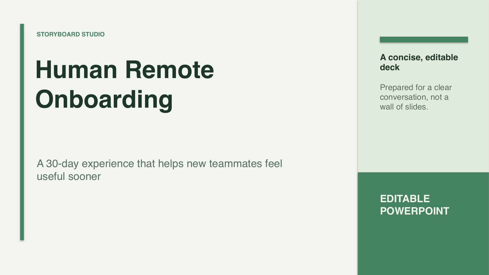

# Storyboard Studio

> Turn a brief into a concise, editable PowerPoint deck — locally by default, with optional Gemini-assisted outlining.

[**Explore the live showcase →**](https://othmaneblial.github.io/Storyboard-Studio/) · [Quick start](#quick-start) · [Export example](#command-line-export) · [Security](SECURITY.md)

**See the complete first-success flow:** [60-second local demo](docs/demo.md) — brief, review, export, then edit the native PowerPoint text.

[](https://github.com/OthmaneBlial/Storyboard-Studio/actions/workflows/ci.yml) [](https://github.com/OthmaneBlial/Storyboard-Studio/releases/latest) [](LICENSE) [](#privacy-and-data)



## Why Storyboard Studio?

Most presentation generators make a pile of slides. Storyboard Studio starts with the story: its local planner turns a short brief into a clear, editable sequence, lets you inspect it in the browser, then renders a polished 16:9 `.pptx` with native PowerPoint elements.

The first workflow is a **private decision brief** for consultants, product and
operations leads, and enablement teams: one decision, the trade-off, and a
reviewable next step. Start from [`examples/templates/decision-brief.json`](examples/templates/decision-brief.json) if you want a concrete path.

- **Useful without an API key.** A deterministic local planner creates an honest, editable outline instead of failing or inventing facts.
- **Optional Gemini co-writer.** Set `GEMINI_API_KEY` to use Gemini for a richer first draft; failures safely fall back to the local planner.
- **Editable by design.** The export uses PowerPoint text and shapes — no flattened slide screenshots.
- **Private by default.** No account, database, analytics, or shared server-side presentation state.
- **A real first success.** Open the app, write a brief, review the story, and download a deck in minutes.

## Quick start

Requires Python 3.10 or newer.

```bash
git clone https://github.com/OthmaneBlial/Storyboard-Studio.git
cd Storyboard-Studio
make setup
make run
```

Open [http://127.0.0.1:8000](http://127.0.0.1:8000). Storyboard works locally without configuration or a network provider.

### Optional Gemini setup

Copy the example file, add your own API key locally, then restart the server:

```bash
cp .env.example .env
# Export GEMINI_API_KEY in your shell or secret manager; .env is intentionally not auto-loaded.
export GEMINI_API_KEY="your-key"
make run
```

`GEMINI_MODEL` defaults to `gemini-2.5-flash`, a current stable Gemini model that supports structured output. You can override it when your account or deployment needs a different supported model. See Google’s [model reference](https://ai.google.dev/gemini-api/docs/models) and the [provider policy](docs/PROVIDER_POLICY.md) before sending sensitive material.

## How it works

1. **Brief the deck** — add a topic, audience/outcome, slide count, tone, and optional slide-level focuses.
2. **Inspect the narrative** — review the title slide plus the editable three-point sequence before exporting.
3. **Own the final file** — export a native PowerPoint deck and refine it in your usual presentation tool.

The FastAPI service validates every public request, limits request size and local rate, creates each export with a random isolated ID, and removes generated server copies after 24 hours.

## Command-line export

Render any valid Storyboard payload without opening the browser:

```bash
make export-sample
# creates output/product-brief.pptx from examples/product-brief.json

make smoke
# starts a disposable local server and verifies brief → API → editable PPTX
```

Or choose your own files:

```bash
python3 generate_pptx.py --input examples/product-brief.json --output output/my-deck.pptx
```

## API

Run the local server and open [http://127.0.0.1:8000/docs](http://127.0.0.1:8000/docs) for the interactive OpenAPI documentation.

| Endpoint | Purpose |
| --- | --- |
| `GET /api/health` | Readiness and optional Gemini configuration state. |
| `POST /api/content` | Produce a validated, editable outline from a brief. |
| `POST /api/presentations` | Render a supplied validated outline to PPTX. |
| `GET /api/presentations/{id}.pptx` | Download an isolated export before its 24-hour expiry. |

## Docker

```bash
docker build -t storyboard-studio .
docker run --rm -p 8000:8000 storyboard-studio
```

For Gemini-assisted drafts, provide `-e GEMINI_API_KEY` at runtime; never bake credentials into an image. Validate local experimental assets with `make validate-assets`.

## Privacy and data

Storyboard Studio is designed for local use. A brief is not persisted as a profile or database record. When you request an export, the server temporarily keeps only the generated `.pptx` in `output/` so it can be downloaded, then removes it after 24 hours. If Gemini is enabled, your brief is sent to the Gemini API; do not enable it for material you are not authorized to share with that provider.

## Development

```bash
make lint
make format-check
make test
```

The test suite covers local outlining, malformed provider output repair, strict request validation, export isolation, the downloadable PPTX flow, and the renderer’s slide contract. See [CONTRIBUTING.md](CONTRIBUTING.md) for the full workflow.

Looking to help? Start with the bounded queue in
[`docs/GOOD_FIRST_ISSUES.md`](docs/GOOD_FIRST_ISSUES.md), or open the pinned
GitHub “Start here” issue with a synthetic brief. Templates, accessibility
fixes, and viewer compatibility reports are especially useful contributions.

## Project status and roadmap

The first public release focuses on a dependable single-machine workflow. Planned next steps are tracked in [ROADMAP.md](ROADMAP.md). Storyboard Studio intentionally does not try to be a collaborative slide editor, a cloud workspace, or a source-of-truth research engine.

## Support and compatibility

See [`SUPPORT.md`](SUPPORT.md) for safe issue reports and [`docs/SUPPORT_MATRIX.md`](docs/SUPPORT_MATRIX.md) for the supported Python, OS, browser, and viewer baseline.

## Security

Please report vulnerabilities privately as described in [SECURITY.md](SECURITY.md). Never paste an API key in an issue.

## License

Storyboard Studio is released under the [MIT License](LICENSE). Contributions
are welcome within the product and privacy contract described in
[`CONTRIBUTING.md`](CONTRIBUTING.md).
