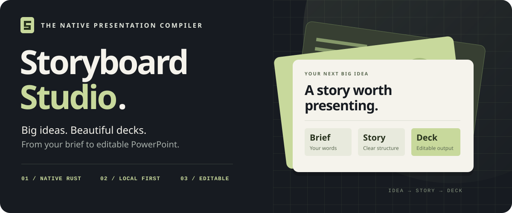
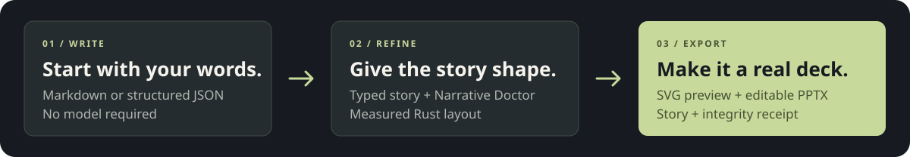
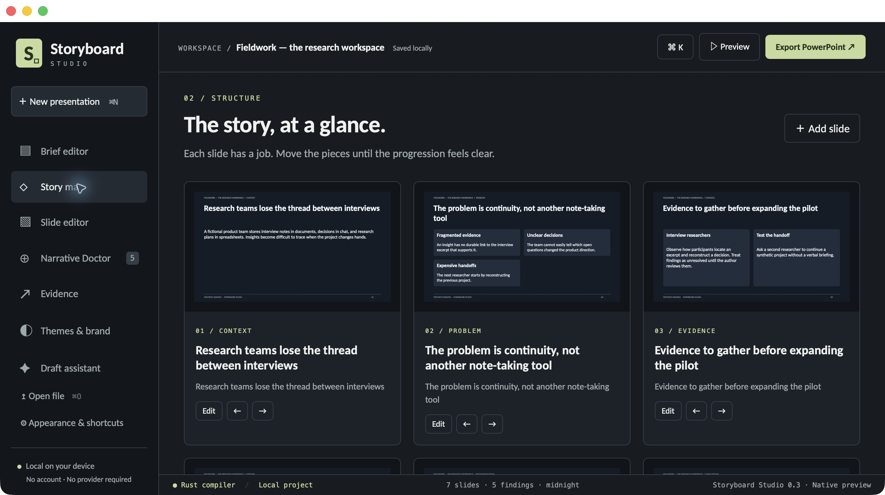
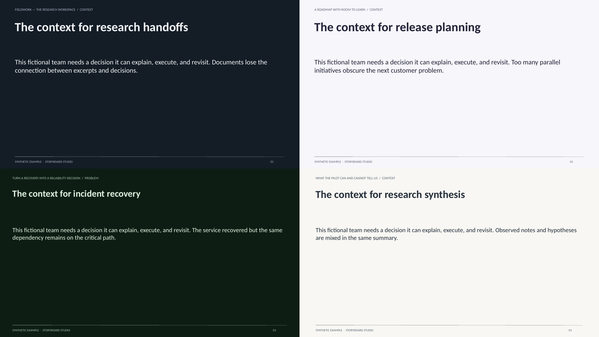

<p align="center">
  
</p>

<p align="center">
  <strong>Write the story. Shape the narrative. Own the deck.</strong><br>
  Turn Markdown and structured briefs into inspectable stories and editable PowerPoint presentations.<br>
  Built in Rust. Runs locally. No account required.
</p>

<p align="center">
  <a href="https://othmaneblial.github.io/Storyboard-Studio/">🌐 <strong>Explore the website</strong></a> &nbsp; · &nbsp;
  <a href="https://github.com/OthmaneBlial/Storyboard-Studio/releases/tag/v0.3.0">📦 <strong>Download</strong></a> &nbsp; · &nbsp;
  <a href="https://othmaneblial.github.io/Storyboard-Studio/#demo">🎬 <strong>Watch 49 seconds</strong></a> &nbsp; · &nbsp;
  <a href="gallery/native/README.md">🖼️ <strong>Browse the gallery</strong></a>
</p>

<p align="center">
  <strong>🦀 Rust engine</strong> &nbsp; / &nbsp; <strong>🔒 Local first</strong> &nbsp; / &nbsp;
  <strong>🎨 12 themes</strong> &nbsp; / &nbsp; <strong>✏️ Editable PPTX</strong> &nbsp; / &nbsp;
  <a href="LICENSE"><strong>MIT license</strong></a>
</p>

> 🚧 **Native preview · v0.3.0** — Downloads currently target Apple Silicon macOS. PowerPoint compatibility remains unverified. See [installation](docs/INSTALLATION.md) and [viewer observations](docs/COMPATIBILITY.md).

---

## ✨ Your ideas, ready to present

<table>
  <tr>
    <td width="50%"><strong>✏️ Real objects. Real edits.</strong><br>Native PowerPoint text, shapes, tables and charts. Embedded images, editable chart workbooks, notes and hyperlinks.</td>
    <td width="50%"><strong>🩺 A sharper story.</strong><br>Narrative Doctor flags weak progression, missing actions, repetition, density and unreviewed evidence.</td>
  </tr>
  <tr>
    <td><strong>🎨 A look that feels like you.</strong><br>Twelve themes, measured typography and local brand kits with your palette and PNG/JPEG logo.</td>
    <td><strong>🔒 Your workspace stays yours.</strong><br>Offline compilation, local projects and autosave. AI drafting is optional and requires explicit approval to send text.</td>
  </tr>
</table>

<a href="gallery/native/startup-pitch/README.md"></a>

<p align="center">
  <em>Actual native output · synthetic startup scenario · rendered in LibreOffice</em><br>
  <a href="gallery/native/startup-pitch/deck.pptx">📥 Editable deck</a> &nbsp; · &nbsp;
  <a href="gallery/native/startup-pitch/deck.story.json">🧩 Story</a> &nbsp; · &nbsp;
  <a href="gallery/native/startup-pitch/deck.receipt.json">🧾 Receipt</a> &nbsp; · &nbsp;
  <a href="gallery/native/startup-pitch/libreoffice-text-check.json">🔍 Viewer text check</a>
</p>

## 🚀 Your first deck

Grab the [Apple Silicon preview](https://github.com/OthmaneBlial/Storyboard-Studio/releases/tag/v0.3.0), or build from source with **Rust 1.95+**. No service or model is needed.

```bash
git clone https://github.com/OthmaneBlial/Storyboard-Studio.git
cd Storyboard-Studio
cargo build --release --locked
./target/release/storyboard build examples/startup-pitch.md -o pitch.pptx
./target/release/storyboard verify pitch.receipt.json
```

**Three files, one reviewable bundle:** `pitch.pptx` + `pitch.story.json` + `pitch.receipt.json`.
Receipts check internal integrity; they do not establish authorship or factual truth.

[📖 Installation guide](docs/INSTALLATION.md) · [💻 CLI guide](docs/CLI.md) · [🧩 Story format](docs/native/FORMAT.md)

## 🧠 From a brief to a story worth showing



The compiler keeps your authored content. Doctor offers specific ways to improve the narrative;
it never fetches sources or certifies truth.

<table>
  <tr>
    <td width="50%"><br><strong>🗺️ See the whole story.</strong><br>Move between your brief, story map and slide properties.</td>
    <td width="50%"><br><strong>🩺 Find the weak spots.</strong><br>Review narrative diagnostics and evidence before export.</td>
  </tr>
</table>

The Tauri desktop adds recent projects, local autosave, preview, evidence review,
themes, brand imports and export. A command palette, keyboard shortcuts, context
menus and native file drop keep the workflow close at hand. CLI and desktop share
the same Rust engine.

## 🎨 Pick your mood. Bring your brand.

**Minimal · Editorial · Midnight · Consulting · Product · Technical**<br>
**Investor · Research · Mono · Swiss · Terminal · Modern**


Import a local brand kit, or edit a theme directly. Carlito is bundled under the
[SIL Open Font License](assets/fonts/OFL.txt).

## 🖼️ Twenty examples to explore

Product launches, engineering decisions, research, strategy, consulting and executive
briefings — each with input, PPTX, story, receipt, diagnostics and previews.

<a href="gallery/native/README.md"></a>

<p align="center">
  <a href="gallery/native/README.md"><strong>Explore all 20 examples →</strong></a>
</p>

All scenarios and data are synthetic. All twenty decks were independently rendered
in LibreOffice with authored text checks. [Viewer observations](docs/COMPATIBILITY.md)
cover package checks, LibreOffice text preservation and Keynote editable objects.

## ⚡ Small engine. Measured speed.

| Editable PPTX | Mean build time |
| :--- | ---: |
| 10 slides | **4.7 ms** |
| 50 slides | **17.8 ms** |
| 100 slides | **34.4 ms** |
| 250 slides | **83.6 ms** |

Apple M2 · 16 GiB · macOS 26.6 · release build · five runs per size.
Times include layout and package validation, and exclude file I/O and office rendering.
Warm CLI startup: **5.3 ms** · benchmark peak RSS: **48.0 MiB** · executable: **7.86 MiB**.
First observed launch: 495.7 ms. [Method and raw measurements →](benchmarks/native/README.md)

## 🤖 AI, when you choose it

OpenAI-compatible endpoints, local Ollama/LM Studio and Gemini can draft text.
Desktop shows the exact text and endpoint, requires approval, and keeps keys in the
session only. Drafts stay in a review area until you choose to apply them.
Sending is bounded and separate from the offline compiler.

## 🛠️ Go deeper

<details>
<summary><strong>💻 CLI commands</strong> — compile, diagnose, preview, render and inspect</summary>

```bash
storyboard new draft.md
storyboard compile draft.md -o draft.story.json
storyboard doctor draft.story.json --json
storyboard preview draft.story.json -o preview.html
storyboard render draft.story.json --theme editorial -o deck.pptx
storyboard render draft.story.json --brand examples/brand/kit.json -o branded.pptx
storyboard validate deck.pptx --json
storyboard diff old.story.json new.story.json
storyboard inspect draft.story.json --layout
storyboard themes
storyboard schema
```

The [command guide](docs/CLI.md) covers preview serving, diagnostics, benchmarks
and the optional draft assistant. `compile ... -o draft.story.md` produces lossless
Markdown interchange. Desktop `.storyboard` projects work through the CLI,
including custom themes. Share their `assets/` directory when moving image projects.

</details>

<details>
<summary><strong>🧑‍💻 Develop locally</strong> — checks, demo and desktop</summary>

```bash
npm --prefix apps/desktop ci
make check
make demo
make desktop
```

GitHub CI is disabled at the owner's request. Run checks locally and record actual
platform and viewer evidence.

[Contributing](CONTRIBUTING.md) · [Architecture](docs/ARCHITECTURE.md) · [Security](SECURITY.md)

</details>

<details>
<summary><strong>🔍 Compatibility and limits</strong> — what has been verified</summary>

Version 0.3.0 is a native preview. Package validation and LibreOffice reports are
bounded evidence, not certification for every PowerPoint version. PowerPoint
remains unverified. Complex script shaping, arbitrary fonts and old story versions
have explicit limits in the [format contract](docs/native/FORMAT.md).

[Viewer observations](docs/COMPATIBILITY.md) · [Migration status](docs/native/MIGRATION.md) · [Roadmap](ROADMAP.md)

</details>

---

<p align="center">
  <br>
  <strong>Your story. Your machine. Your deck.</strong><br>
  <a href="https://othmaneblial.github.io/Storyboard-Studio/">Website</a> ·
  <a href="https://github.com/OthmaneBlial/Storyboard-Studio/releases/tag/v0.3.0">Downloads</a> ·
  <a href="ROADMAP.md">What’s next</a> · <a href="LICENSE">MIT</a>
</p>
