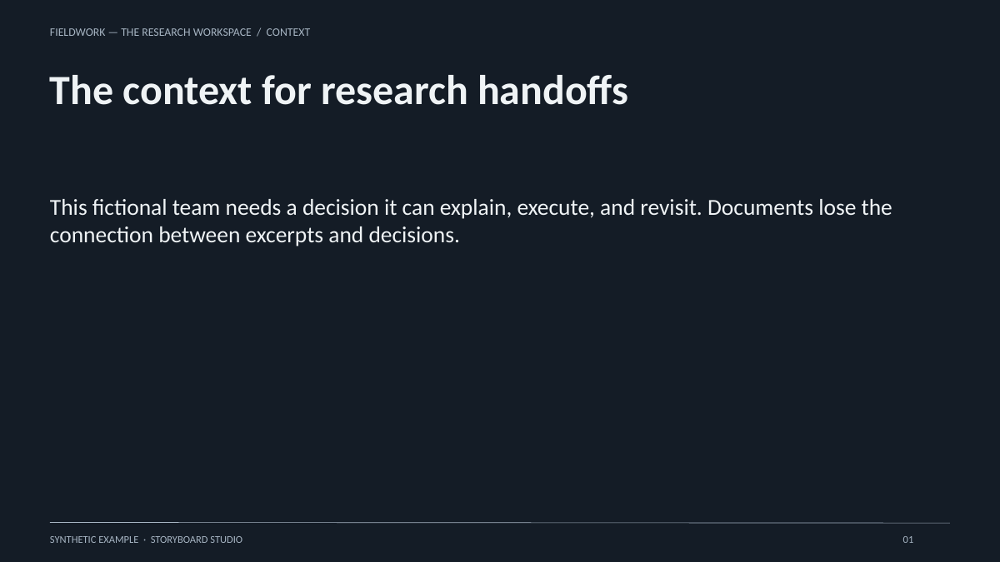
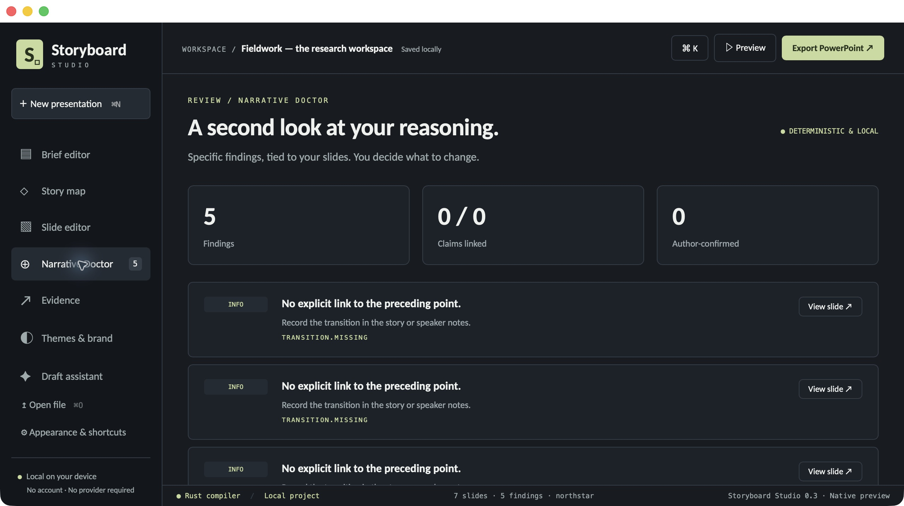
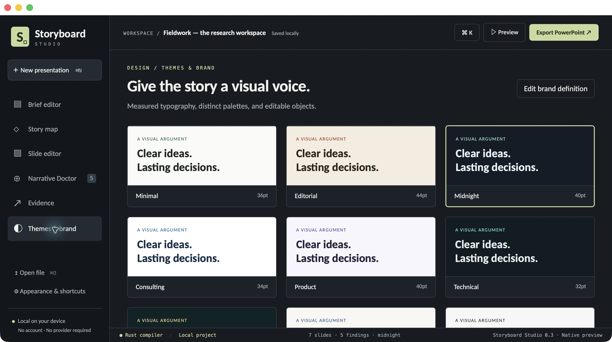

<p></p>

# Storyboard Studio

**The native presentation compiler.** Turn Markdown and structured briefs into
inspectable stories and editable PowerPoint decks. Built in Rust. Runs locally.

[Gallery](gallery/native/README.md) · [Installation](docs/INSTALLATION.md) ·
[Desktop](apps/desktop) · [Format](docs/native/FORMAT.md) · [Roadmap](ROADMAP.md)



This is a synthetic startup example, generated by the Rust engine. Download its
[editable PowerPoint](gallery/native/startup-pitch/deck.pptx),
[story](gallery/native/startup-pitch/deck.story.json),
[receipt](gallery/native/startup-pitch/deck.receipt.json) and
[viewer text check](gallery/native/startup-pitch/libreoffice-text-check.json).

## Build a deck

Requires Rust 1.95+. No service or model is needed.

```bash
git clone https://github.com/OthmaneBlial/Storyboard-Studio.git
cd Storyboard-Studio
cargo build --release --locked
./target/release/storyboard build examples/startup-pitch.md -o pitch.pptx
./target/release/storyboard verify pitch.receipt.json
```

The bundle contains `pitch.pptx`, `pitch.story.json` and `pitch.receipt.json`.
Text, shapes, tables and charts are native editable PowerPoint objects. Images
are embedded; charts include an editable workbook. Notes and hyperlinks survive
export. Receipts check internal integrity, not authorship or factual truth.

## From brief to reviewable story

```text
Markdown / structured JSON
            ↓
Typed story → Narrative Doctor
            ↓
Measured Rust geometry
       ↙          ↘
SVG preview     editable PPTX + story + receipt
```

The compiler keeps authored content. Doctor points to missing ownership/actions,
unsupported claims, unreviewed evidence, repetition, density and weak progression.
It offers specific changes; it never fetches sources or certifies truth.



The Tauri desktop provides a brief editor, story map, slide properties, recent
projects, local autosave, preview, evidence review, themes, brand imports and export.
Use the command palette, keyboard shortcuts, context menus or native file drop.
The same Rust engine powers CLI and desktop. No account is required.

## CLI

```bash
storyboard new draft.md
storyboard compile draft.md -o draft.story.json
storyboard doctor draft.story.json --json
storyboard preview draft.story.json -o preview.html
storyboard render draft.story.json --theme editorial -o deck.pptx
storyboard render draft.story.json --brand examples/brand/kit.json -o branded.pptx
storyboard validate deck.pptx --json
storyboard diff old.story.json new.story.json
storyboard inspect draft.story.json --layout
storyboard themes
storyboard schema
```

[Command guide](docs/CLI.md) includes local preview serving, diagnostics, benchmarks
and the optional draft assistant. `compile ... -o draft.story.md` produces lossless
Markdown interchange. Desktop `.storyboard` projects also work through the CLI,
including custom themes. Share their `assets/` directory when moving image projects.

## Themes and examples

Twelve distinct palettes and measured typography: Minimal, Editorial, Midnight,
Consulting, Product, Technical, Investor, Research, Mono, Swiss, Terminal and Modern.
Import a local brand kit with a theme and PNG/JPEG logo, or edit a theme directly.
Carlito is bundled under the SIL Open Font License.



[Twenty generated examples](gallery/native/README.md) cover product, engineering,
research, strategy, consulting and executive decisions. All scenarios and data are
synthetic. Each includes input, PPTX, story, receipt, diagnostics and previews.
All twenty were independently rendered in LibreOffice with authored text checks.

## Optional AI

OpenAI-compatible endpoints, local Ollama/LM Studio and Gemini can draft text.
Sending is explicit, bounded and separate from the offline compiler. Desktop shows
the exact text and endpoint, requires approval, and keeps keys in the session only.
Returned drafts stay in a review area until you choose to apply them.

## Measured native performance

Apple M2, 16 GiB, macOS 26.6, release build; five runs per size. Editable PPTX
with layout and package validation: **10 slides 4.7ms · 50 slides 17.8ms ·
100 slides 34.4ms · 250 slides 83.6ms**. These exclude file I/O and office rendering.
CLI warm process startup 5.3ms, first observed launch 495.7ms, benchmark peak RSS
48.0 MiB and executable 7.86 MiB. [Full method and raw measurements](benchmarks/native/README.md).

## Develop locally

```bash
npm --prefix apps/desktop ci
make check
make demo
make desktop
```

GitHub CI is disabled at the owner's request. Run checks locally and record actual
platform/viewer evidence. See [Contributing](CONTRIBUTING.md),
[Architecture](docs/ARCHITECTURE.md) and [Security](SECURITY.md).

Version 0.3.0 is a native preview. Package validation and the LibreOffice reports
are bounded evidence, not certification for every PowerPoint version. Complex
script shaping, arbitrary fonts and old story versions have explicit limits in
the [format contract](docs/native/FORMAT.md). MIT licensed.
