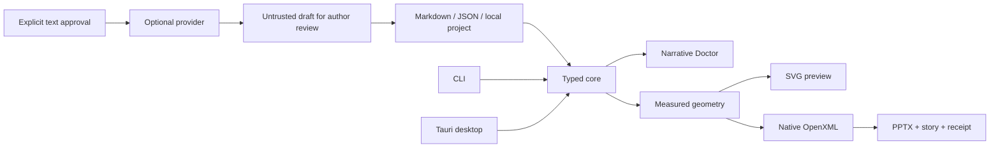

# Native architecture

Four Rust crates and one thin desktop client:

| Component | Responsibility |
| --- | --- |
| `storyboard-core` | Strict story/project types, authored compilation, Doctor, measured layout and themes |
| `storyboard-pptx` | Direct OpenXML, media/workbooks, shared SVG preview, package validation, portable images and receipts |
| `storyboard-ai` | Explicit bounded text requests; provider credentials never enter project serialization |
| `storyboard-studio` | Native `storyboard` CLI, local preview and real timing harness |
| `apps/desktop` | Static WebView interface with scoped Tauri commands and native dialogs |

The deterministic core performs no file, network or process operations. Rendering
reads only validated bounded images under a caller-selected project root. All
native layout uses points on a 960×540 canvas; bundled regular/bold Carlito metrics
set line breaks. Overflow reduces type to the minimum then fails without deleting
copy. Preview and PPTX consume the same geometry. Native chart labels can differ
between viewers.

The desktop owns app-data projects and grants import paths through native dialogs
or actual drop events. Atomic saves precede normal window closing. Project images
are content-addressed, immutable sidecars; exports embed them as well. Existing
bundle files are retained for rollback until replacement succeeds.

Archive validation bounds expanded data, rejects traversal/duplicate parts/DTDs,
checks namespaces and relationships, counts slides and recovers text. It is not a
complete ECMA-376 XSD validator. Unsigned receipts prove bundle consistency only.
Future renderers can consume resolved geometry without adding a plugin runtime.
