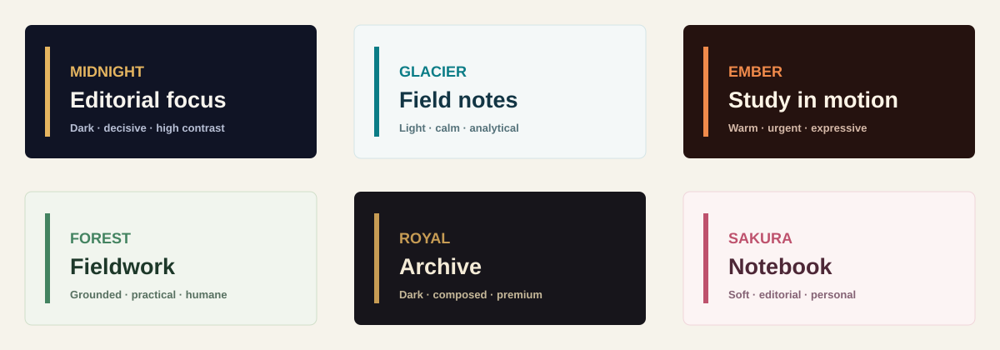

# Themes and editorial blocks

The six themes share the same safe layout system: a 0.55-inch outer margin,
bounded text boxes, a 16:9 canvas, and a contrast-aware text/muted/accent token
set. The renderer uses `Aptos Display`/`Aptos` when available and falls back to
the viewer's normal sans/serif substitution without changing the canvas.

| Theme | Intended use | Contrast rule | Supported blocks |
| --- | --- | --- | --- |
| Midnight | Decisive briefings and product narratives | Light text on deep navy; ochre accent | Standard, comparison, decision, timeline, metric |
| Glacier | Calm analysis and field notes | Navy text on pale blue-gray; teal accent | Standard, comparison, decision, timeline, metric |
| Ember | Urgent change and creative studies | Warm light text on dark brown; orange accent | Standard, comparison, decision, timeline, metric |
| Forest | Practical plans and humane operations | Deep green text on pale green; green accent | Standard, comparison, decision, timeline, metric |
| Royal | Premium strategy and archival material | Cream text on near-black; gold accent | Standard, comparison, decision, timeline, metric |
| Sakura | Personal, editorial, reflective work | Plum text on soft pink; rose accent | Standard, comparison, decision, timeline, metric |

Editorial blocks are native PowerPoint shapes, not images:

- **Comparison** adds a before/after pair.
- **Decision** adds an explicit directional chevron.
- **Timeline** adds three sequence markers.
- **Metric** adds a large signal callout.
- **Standard** keeps the neutral key-frame treatment.

Every block retains the same three bullet points as a plain-text equivalent.
If a viewer substitutes fonts or has accessibility settings enabled, content
remains selectable and bounded rather than being rasterized.
