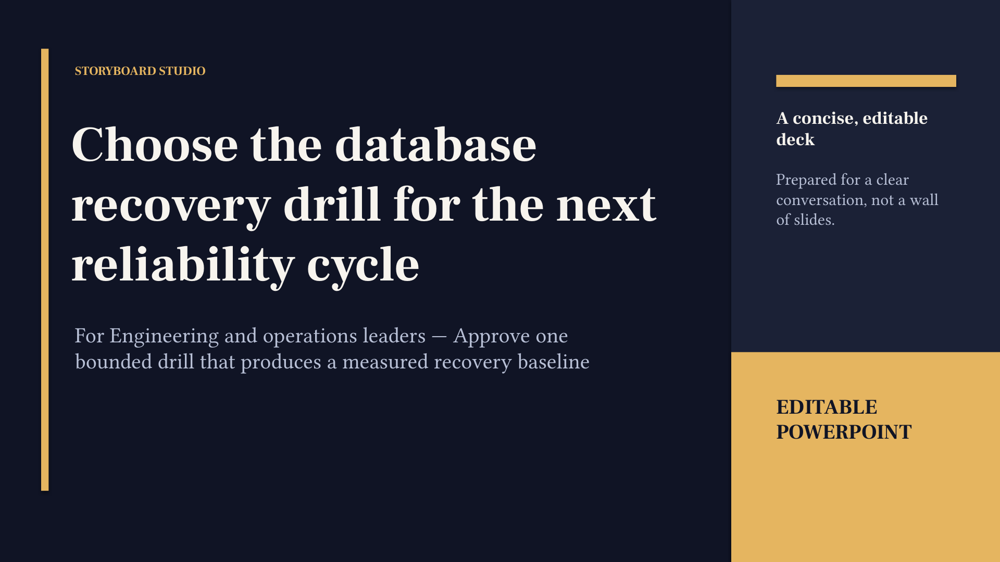

# Golden example: recovery drill



- Author input: [`examples/briefs/recovery-drill-decision.json`](../../examples/briefs/recovery-drill-decision.json)
- Compiled story: [`deck.story.json`](deck.story.json)
- Editable presentation: [`deck.pptx`](deck.pptx)
- Narrative Receipt: [`deck.receipt.json`](deck.receipt.json)
- Viewer result for the regenerated deck: **not run**. The screenshot above
  belongs to the historical August fixture, not this regenerated PowerPoint.
  Current Office rendering and native-edit checks remain a release gate.
- Receipt v2 verifies the current files and recomputes derived review metadata;
  it does not authenticate an author or certify factual truth.

Regenerate from the repository root:

```bash
storyboard compile \
  --input examples/briefs/recovery-drill-decision.json \
  --output gallery/recovery-drill/deck.story.json
storyboard export \
  --input gallery/recovery-drill/deck.story.json \
  --output gallery/recovery-drill/deck.pptx \
  --bundle
storyboard verify gallery/recovery-drill/deck.receipt.json
```
